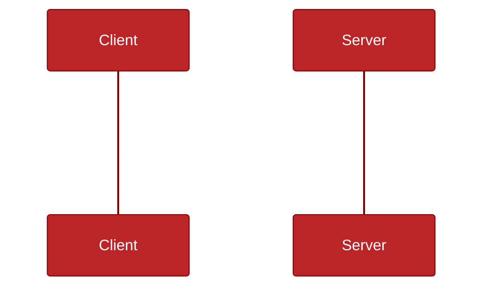

# MCP Core Components

The Model Context Protocol is structured around three main component layers:

- **Protocol Layer** (how we format and manage messages)
- **Transport Layer** (how we send/receive data)
- **Message Types** (the kinds of information exchanged)

Each layer is **independent and replaceable**, making MCP very modular and powerful for AI system designs.

---
layout: two-cols-header
class: [m-4,text-sm]
---

### Protocol Layer (Message Manager)

::left::

- Message framing: Wrap requests, notifications, results, and errors.
- Linking requests to their corresponding responses.
- Communication patterns (Request-Response and Notifications).
- Error handling
- Lifecycle management (init, shutdown, reconnect)

It is implemented mainly through: 

- **Python**: `Session` class
- **TypeScript**: `Protocol` class

::right::

**Protocol Handling**

---
class: [ bg-black/70, text-sm ]
---

## 🚛 Transport Layer (Message Carrier)

> The **Transport Layer** defines **how the bytes actually travel** between Client and Server.

> It **does not** care about the content — it only **moves JSON-RPC messages**.

 

**Transport and Protocol Separation**

 

 

- Session prepares messages.
- Transport sends/receives messages.
- Wire is the physical communication medium (pipes, TCP).

---
class: ["bg-black/70", "text-xs" ]
layout: image-right
image: /mcp_transport_choose.png
---

### ✈️ Built-in Transport Types

  
| Transport | Description | Use case |
|:---|:---|:---|
| **stdio** | Standard input/output streams | Local scripts, command-line tools. |
| **HTTP+SSE** | Server-Sent Events + HTTP POST | Web apps, remote communication. |

  
> Both use **JSON-RPC 2.0** for formatting.

---
class: [ bg-black/70, text-sm ]
---

### JSON-RPC 2.0 Message Formats
  

| Type | Example |
|:---|:---|
| **Request** | `{ "jsonrpc": "2.0", "id": 1, "method": "methodName", "params": {...} }` |
| **Response** | `{ "jsonrpc": "2.0", "id": 1, "result": {...} }` |
| **Error** | `{ "jsonrpc": "2.0", "id": 1, "error": { "code": -32600, "message": "Invalid Request" } }` |
| **Notification** | `{ "jsonrpc": "2.0", "method": "eventName", "params": {...} }` |
