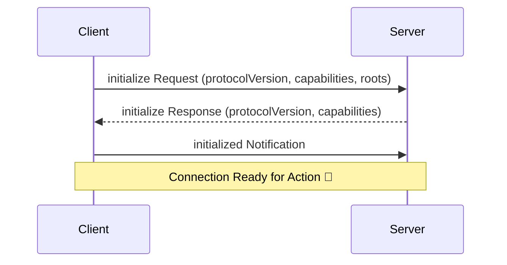

# MCP Connection Lifecycle

---
layout: two-cols
class: m-10
---

## 🧩 Initialization Phase

When a connection starts, **both sides** need to agree on:
- Protocol version
- Capabilities (what can be done)
- Roots (optional: suggested workspace URIs)

::right::

Initialization Message Flow

---
layout: center
---

{width=700 height=auto loading=lazy}

---

## 🛡️ Error Handling in Lifecycle

MCP defines standard error codes based on **JSON-RPC 2.0**:

| Error Code | Meaning |
|:---|:---|
| `-32700` | Parse Error (Invalid JSON) |
| `-32600` | Invalid Request |
| `-32601` | Method Not Found |
| `-32602` | Invalid Params |
| `-32603` | Internal Error |

Servers can define their own error codes > **-32000** for custom scenarios.