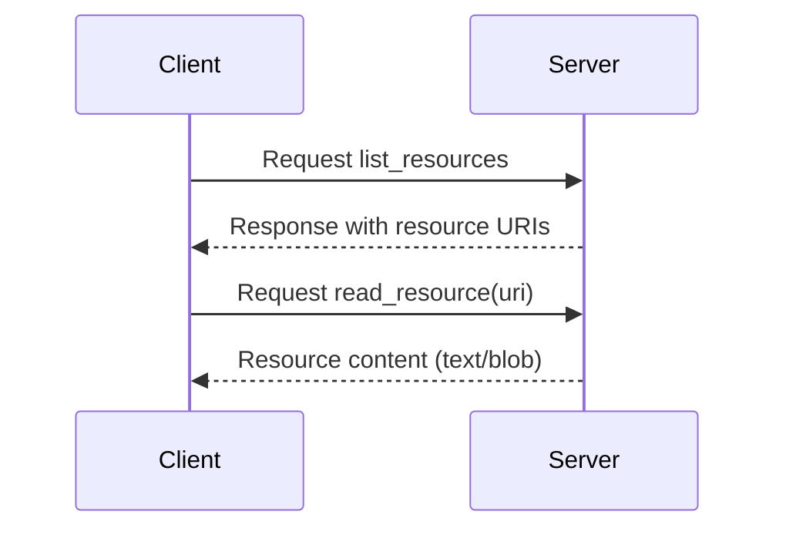
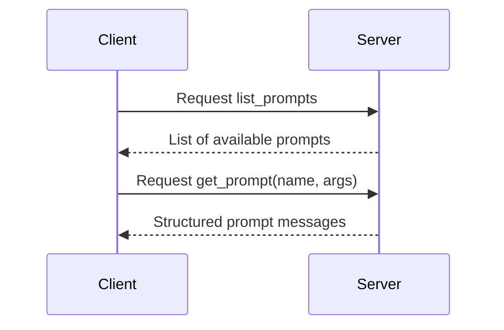
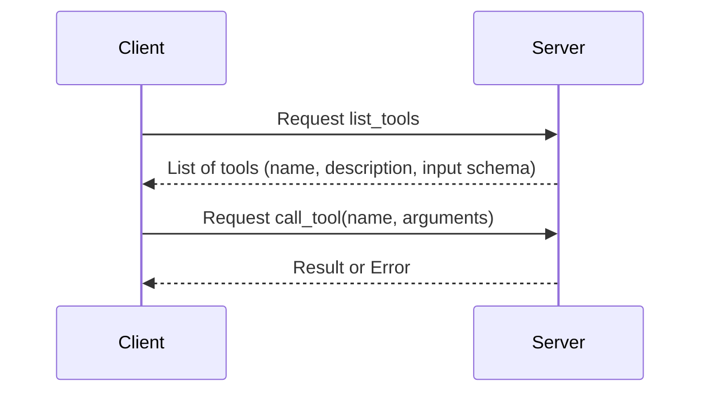

# MCP Core Primitives: Resources, Prompts, Tools

|  | <span v-mark.highlight.red font-bold>Resources</span> | <span v-mark.highlight.red font-bold>Prompts</span> | <span v-mark.highlight.red font-bold>Tools</span> |
|:---|:---|:---|:---|
| Purpose | 👉 Provide static/dynamic context | Structure interaction | Perform actions |
| Control | 👉 Application-controlled | User-controlled | Model-controlled |
| Data | 👉 Text/Binary | Structured Messages | Action Outputs |
| Example | 👉 Fetch project docs | Guide code review | Create Jira Ticket |

---

## 📦 Resources (Data Providers)

> Resources **expose read-only data** that the LLM can load into its context.
Think of them like the **"Files"** or **"APIs"** the model can read.

<div class="grid grid-cols-2 gap-4 py-2 text-xs">
<div>
Example of a Resource

```python
@mcp.resource("info://server/welcome")
def welcome_message() -> str:
    """Static welcome message."""
    return "Welcome to the best AI server!"
```

✅ This will expose:
- **URI**: `info://server/welcome`
- **Data**: `"Welcome to the best AI server!"`
</div>
<div class="h-1/2 text-center">
Resource Discovery and Reading


</div>
</div>

Resource Best Practices

<div class="text-xs mb-10">

- Examples: `schema://db/{table}`, `schema://{name}`, `file://path/to/file.txt`
- Use **clear, descriptive URIs** (e.g., `file://logs/error.log`, not `file://1234`).
- Always **define MIME types** when possible (like `text/plain` or `application/json`).

</div>

<style>
blockquote {
  @apply text-sm text-gray-300 italic mb-2;
}
</style>

---
class: text-[7px]
---

## 🧩 Prompts (Conversation Starters)

**Prompts** are:
- **reusable** - user-controlled templates that define how to start interactions with an LLM.
- **dynamic** — you can provide arguments, insert context, and even chain steps.
<div class="h-1 b-1 my-4"></div>
<div class="grid grid-cols-2 gap-4 py-4">
<div>
Example of a Prompt

```python
@mcp.prompt()
def review_code(code: str) -> str:
    return f"Please review the following code for improvements:\n\n{code}"
```

This will allow a client to:
- List available prompts.
- Pick "review_code".
- Supply `code="print('Hello World')"` as argument.

</div>
<div class="text-center">
Prompt Discovery and Usage


</div>
</div>

<style>
ul {
  @apply list-circle pl-5 text-xs;
}
strong {
  @apply text-sm font-bold;
}
</style>

---
layoutClass: text-xs
class: text-lg
---

## ⚙️ Tools (Actions and Functions)

> **Tools** allow **LLMs to perform real-world actions** via your server: `Modify databases, Call external APIs, Send notifications, Perform calculations`.
> They are **model-controlled** with **user-in-the-loop approvals**.

<div class="grid grid-cols-2 gap-4 py-10">
<div class>
Example of a Tool

```python
@mcp.tool()
def calculate_bmi(weight_kg: float, height_m: float) -> float:
    """Calculate Body Mass Index (BMI)."""
    return weight_kg / (height_m ** 2)
```
</div>

<div class="text-center">

**Tool Discovery and Calling**



</div>
</div>

<style>
blockquote {
  @apply text-sm text-gray-500 italic;
}
</style>